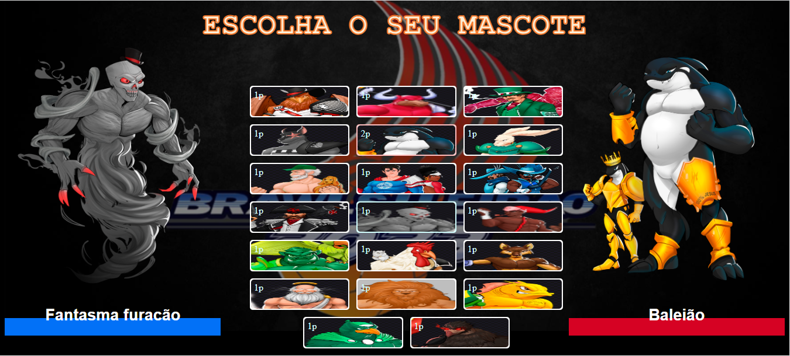
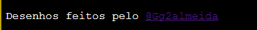

# Sobre
Um projeto que simula uma tela de seleção de persongens de um jogo de luta.
As artes foram feitas pelo @Gg2almeida.
A aplicação fornece 20 mascotes do brasileirão 2023, em forma de personagens de luta,
de modo de imaginar o usuario escolha o seu mascote como personagem para poder lutar.
O JS é o responsavel por trocar as imagens dos mascotes lutadores, usando de seus ids para isso.

# Tecnologias utilizadas

  

# Imagens

# Artista que fez os desenhos

  

# Aplicação completa

